# StickerStore — 生產級全端電商系統


> **React 19 × Spring Boot 4** 打造的完整電商解決方案 — 從前端互動體驗、Stripe 金流整合，到後端安全架構與多環境部署，每一層都按業界標準設計。

一套從零架構、可直接上線的貼紙電商系統。本專案貫穿全端工程的核心議題：**JWT 無狀態認證**、**Cookie-based CSRF 雙重防護**、**React Router Data API 資料流設計**、**Redux 與 Context 的狀態管理分工**，以及針對生產環境的多 Profile 配置與快取策略。

---

## 目錄

1. [視覺展示](#1-視覺展示)
2. [系統架構與專案結構](#2-系統架構與專案結構)
3. [核心功能與亮點](#3-核心功能與亮點)
4. [技術棧](#4-技術棧)
5. [快速開始與本地部署](#5-快速開始與本地部署)
6. [附錄](#6-附錄)

---

## 1. 視覺展示

### 畫面截圖

> 展開下方分組可看其餘 8 張；所有截圖放在 [`docs/screenshots/`](./docs/screenshots)。

#### 首頁

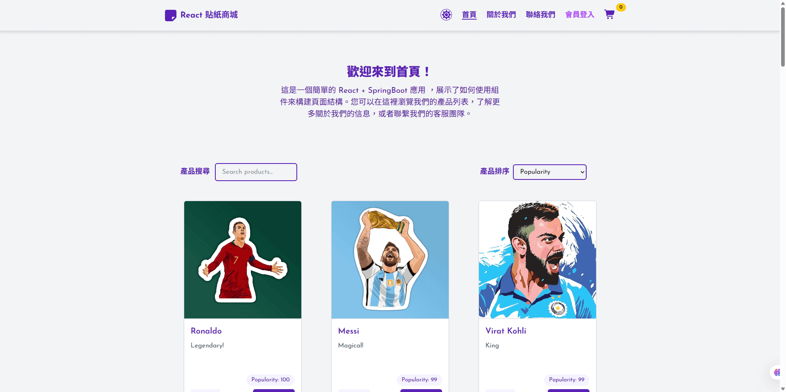

<details>
<summary><b>🔓 公開頁面（不需登入）— 商品詳情、購物車、聯絡我們</b></summary>

<br>

**商品詳情** — `/products/:productId`，商品大圖、價格、數量選擇與加入購物車

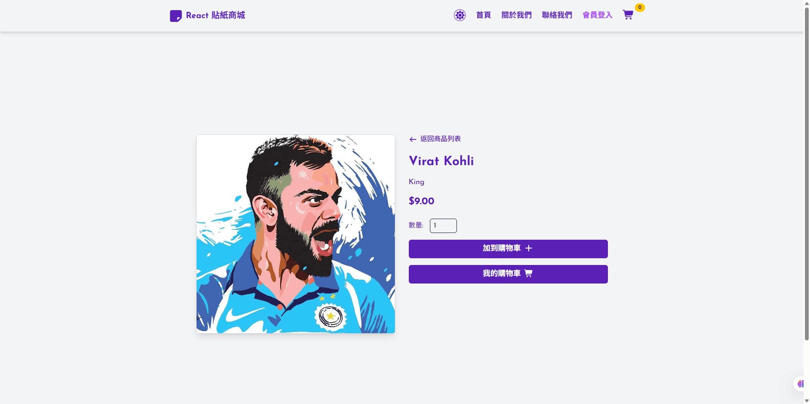

**購物車** — `/cart`，數量調整、移除、即時小計；未登入亦可加入商品

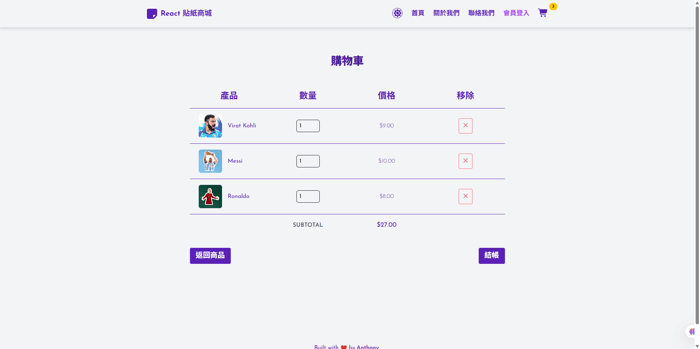

**聯絡我們** — `/contact`，左側聯絡資訊依 Profile 注入，表單為公開端點且免 CSRF

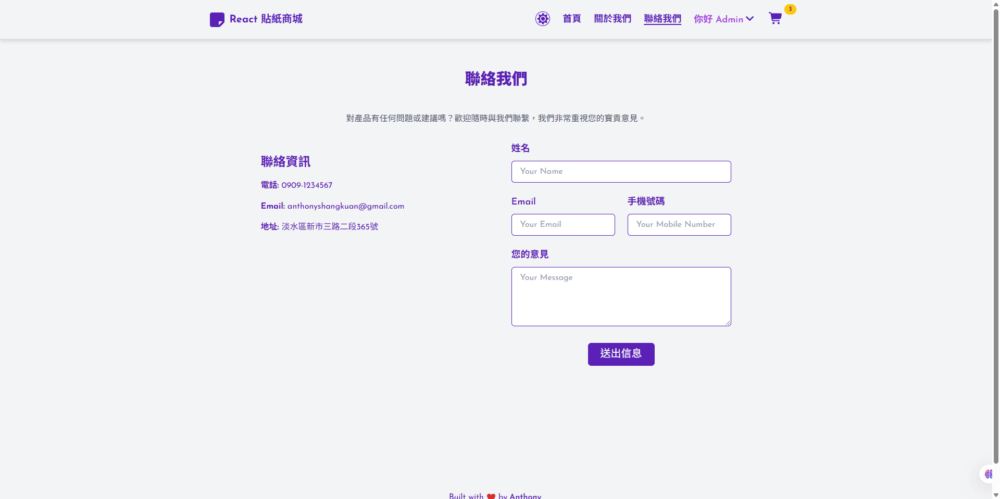

</details>

<details>
<summary><b>👤 需登入頁面（ProtectedRoute）— Stripe 結帳、歷史訂單、個人檔案</b></summary>

<br>

**Stripe 結帳** — `/checkout`，分離式卡片欄位（卡號／有效日期／CVC）

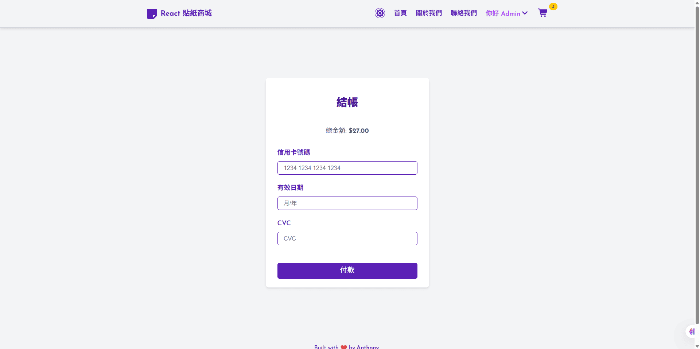

**我的歷史訂單** — `/orders`，訂單狀態、總價、日期與明細品項

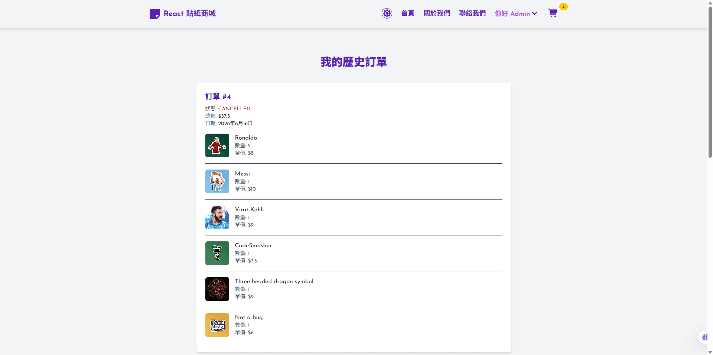

**個人檔案** — `/profile`，個人資料與收件地址一站管理

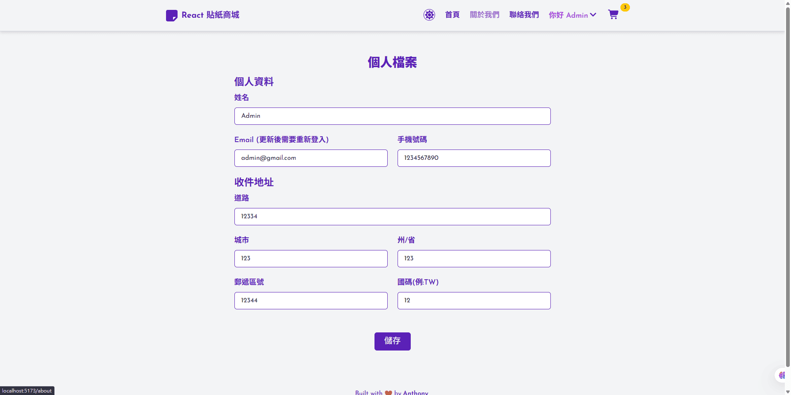

</details>

<details>
<summary><b>🛠️ 管理後台 — 訂單管理、信息管理（需登入，ADMIN 權限由後端強制）</b></summary>

<br>

**訂單管理** — `/admin/orderManage`，待處理訂單一鍵成立或取消

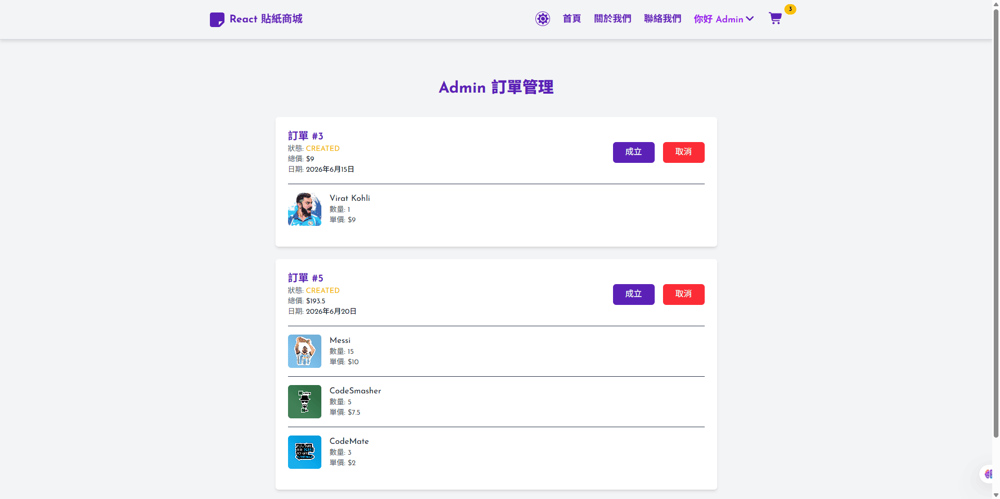

**信息管理** — `/admin/messages`，客服留言集中處理、標記已讀並關閉

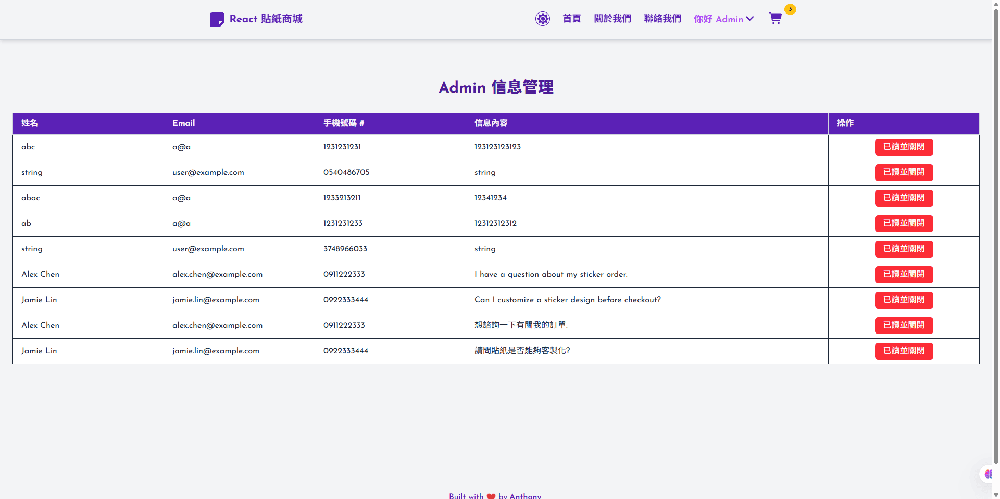

</details>

### 使用者旅程

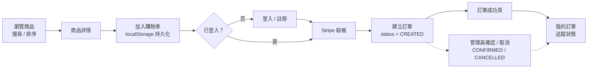

### 登入認證時序

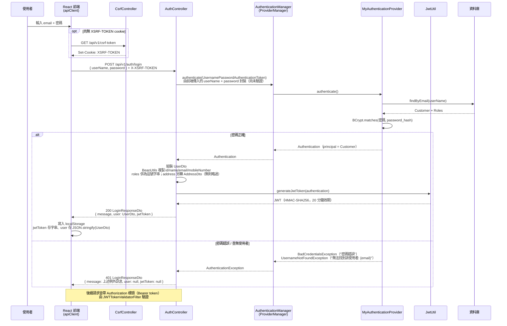

失敗時的 `message` 直接取自例外訊息 —— `MyAuthenticationProvider` 丟出 `BadCredentialsException("密碼錯誤")` 或 `UsernameNotFoundException("無法找到該使用者: " + email)`，`AuthController.buildErrorResponse()` 再把它放進 `LoginResponseDto` 的 `message` 欄位（`user` 與 `jwtToken` 皆為 `null`）。

前端 `Login.jsx` 以 `error.response?.data?.message || "輸入的帳號或密碼錯誤"` 取值，因此**後端訊息優先**；只有在連線失敗等拿不到回應主體的情況下，才會顯示那句預設文字。最終由 `toast.error()` 呈現。

### 頁面地圖

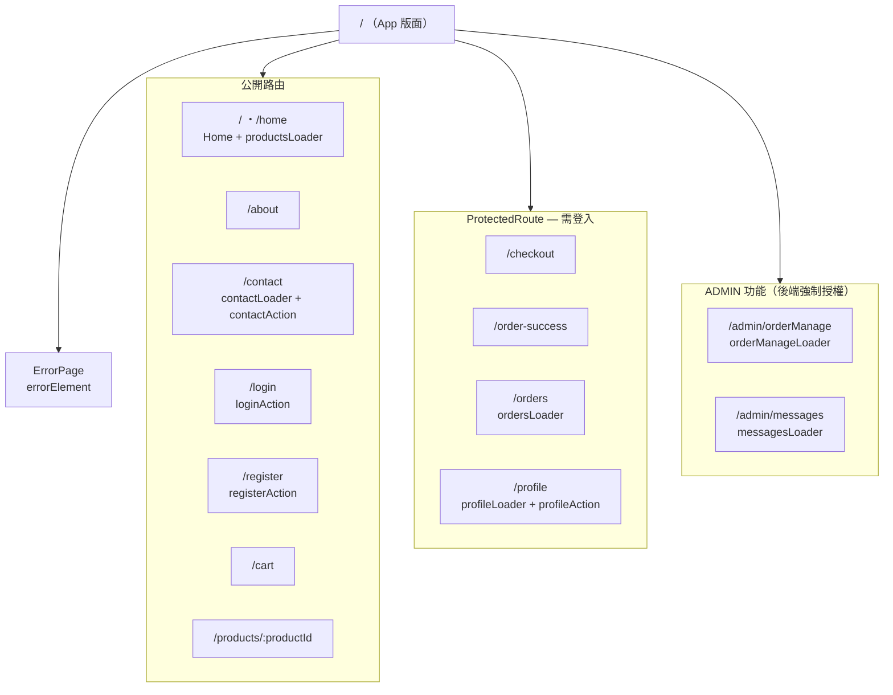

### 路由與元件全貌

上圖聚焦在路由的存取層級；下圖則把 Provider 巢狀、路由定義、元件組成與 API 呼叫串在一起，可看出每個頁面實際由哪些元件構成、以及哪些頁面會打後端。

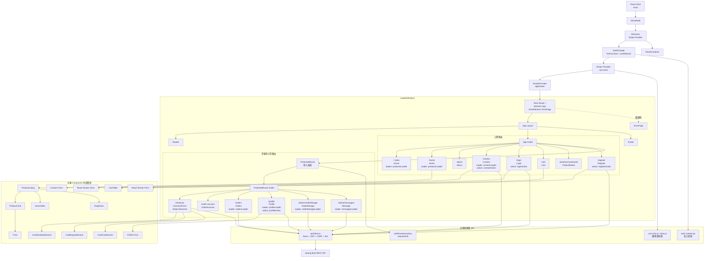

---

## 2. 系統架構與專案結構

### 系統架構

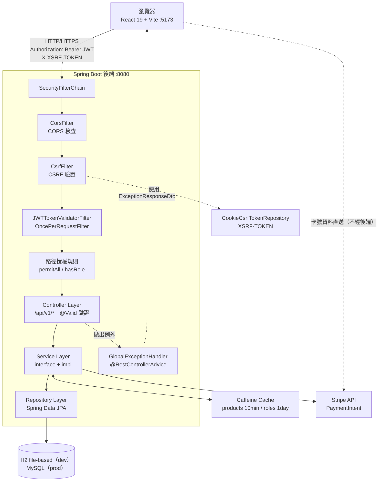

### 前後端分離設計

- 後端為純 REST API，以 JSON 通訊，不渲染任何 HTML 頁面
- CORS 允許來源由 `stickerstore.cors.allowed-origins` 屬性控制，預設 `http://localhost:5173,http://localhost:8080`
- 前端以 Vite 多環境 `.env` 檔管理 `VITE_API_BASE_URL`，不硬編碼 API 位址
- 所有跨切面關注點（JWT 注入、CSRF token、401 處理）集中在單一 `apiClient.js`

### 前端專案結構

```
frontend/
├── .env / .env.dev / .env.production     三套 VITE_API_BASE_URL
├── vite.config.js                        port 5173、manualChunks 程式碼分割
├── eslint.config.js
├── index.html
├── public/
│   └── stickers/                         43 張商品貼紙圖（PNG）
└── src/
    ├── main.jsx                          createBrowserRouter 路由定義 + Provider 巢狀
    ├── App.jsx / App.css / index.css / custom.scss
    ├── api/
    │   └── apiClient.js                  Axios 實例 + Request/Response 攔截器
    ├── assets/util/                      emptycart.png、error.png、order-confirmed.png
    ├── components/
    │   ├── Header.jsx                    導覽列、購物車徽章、深色模式、使用者/管理選單
    │   ├── ErrorPage.jsx                 errorElement 統一錯誤頁
    │   ├── about/About.jsx
    │   ├── contact/Contact.jsx
    │   ├── footer/                       Footer.jsx + footer.module.css
    │   ├── cart/                         Cart、CartTable、CheckoutForm、OrderSuccess
    │   ├── home/
    │   │   ├── Home.jsx、PageHeading.jsx、PageTitle.jsx
    │   │   └── product/                  ProductListing、ProductCard、ProductDetail
    │   │                                 SearchBox、DropDown、Price
    │   └── login/
    │       ├── Login、Register、Profile、Orders、ProtectedRoute
    │       └── admin/                    OrderManage、Message
    ├── data/products.js                  靜態商品備援資料
    ├── store/
    │   ├── store.js                      configureStore + subscribe 同步 localStorage
    │   ├── cart-slice.js                 購物車 Redux slice
    │   ├── auth-context.jsx              AuthContext（JWT / 登入狀態）
    │   └── cart-context.jsx              遷移 Redux 前的遺留實作
    └── utils/authRouteGuards.js          登入後導回原頁的輔助函式
```

### 後端專案結構

```
backend/src/main/java/com/example/backend/
├── BackendApplication.java
├── config/
│   ├── CaffeineCacheConfig.java     products TTL 10min；roles TTL 1 day
│   ├── AuditorAwareImpl.java        從 SecurityContext 取 email 作為 auditor
│   ├── CorsConfig.java              allowedOrigins 由 application.properties 注入
│   └── StripeConfig.java            @PostConstruct 初始化 Stripe.apiKey
├── constant/
│   └── ApplicationConstants.java    JWT_SECRET、ORDER_STATUS_* 等常數集中定義
├── controller/                      @RestController，@RequestMapping("/api/v1/...")
│   ├── AuthController               登入、註冊
│   ├── ProductController            商品列表
│   ├── ContactController            聯絡表單（含 @ConfigurationProperties 聯絡資訊）
│   ├── ProfileController            個人資料 GET / PUT
│   ├── OrderController              訂單 GET / POST
│   ├── PaymentController            Stripe PaymentIntent
│   ├── AdminController              訂單管理、留言管理
│   ├── CsrfController               CSRF token 端點
│   ├── DummyController              教學示範：query param / path variable / headers
│   └── ScopeController              教學示範：Bean scope
├── dto/                             Response 物件（大量使用 Java Record）
├── entity/                          JPA 實體，繼承 BaseEntity
├── exception/
│   ├── GlobalExceptionHandler.java  @RestControllerAdvice 統一錯誤處理
│   ├── ResourceNotFoundException
│   └── DuplicateFieldException
├── payload/                         Request 物件（@Valid + Bean Validation）
├── repository/                      Spring Data JPA（介面自動生成實作）
├── scope/                           教學示範：Application/Request/Session Scoped Bean
├── security/
│   ├── MySecurityConfig.java        SecurityFilterChain 定義
│   ├── JWTTokenValidatorFilter.java OncePerRequestFilter，解析 Bearer token
│   ├── MyAuthenticationProvider.java 自訂認證邏輯（查 DB + BCrypt）
│   ├── JwtUtil.java                 generateJwtToken / 解析 Claims
│   └── PublicPathConfig.java        公開路徑 bean，集中管理
└── service/
    ├── *Service.java                介面定義（依賴倒置原則）
    └── impl/*ServiceImpl.java       業務邏輯實作

backend/src/main/resources/
├── application.properties           預設 profile（H2）
├── application-qa.properties        QA profile
├── application-prod.properties      Production profile（MySQL）
├── stripe.properties                stripe.apiKey（支援 STRIPE_API_KEY 覆寫）
└── sql/
    ├── schema.sql                   建立所有資料表
    └── data.sql                     MERGE INTO 冪等種子資料
```

### 資料模型

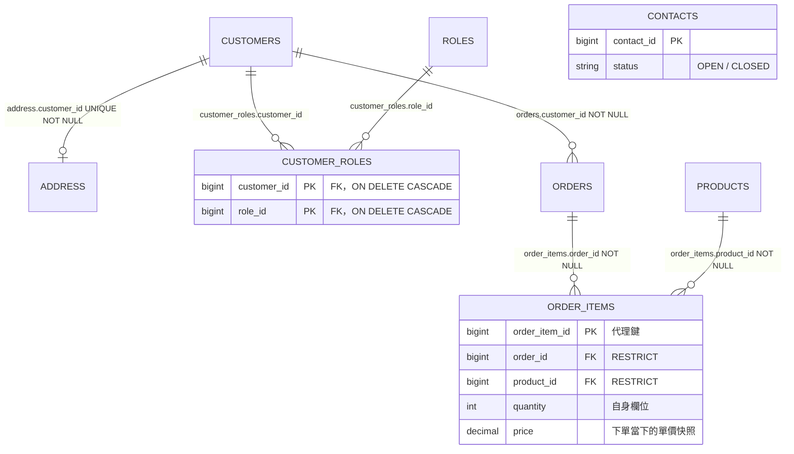

| 符號 | 讀作 |
|---|---|
| `\|\|` | 剛好一筆（必填） |
| `o\|` | 零或一筆（選填） |
| `}o` / `o{` | 零到多筆 |

逐條關聯：

| 關聯 | 讀法 | 外鍵位置 |
|---|---|---|
| `CUSTOMERS \|\|--o\| ADDRESS` | 一位客戶最多一筆地址；**註冊時不填，之後在個人檔案補** | `address.customer_id` **NOT NULL + UNIQUE** |
| `CUSTOMERS \|\|--o{ CUSTOMER_ROLES`<br/>`ROLES \|\|--o{ CUSTOMER_ROLES` | 兩條合起來構成多對多：一位客戶可有多個角色，一個角色可給多人 | 中介表 `customer_roles`（`customers` 表**不含** `role_id`）<br/>owning side：`Customer.roles` 的 `@JoinTable` |
| `CUSTOMERS \|\|--o{ ORDERS` | 一位客戶可有多筆訂單；**每筆訂單一定屬於某位客戶** | `orders.customer_id` **NOT NULL** |
| `ORDERS \|\|--o{ ORDER_ITEMS` | 一筆訂單含多個品項 | `order_items.order_id` **NOT NULL** |
| `PRODUCTS \|\|--o{ ORDER_ITEMS` | 一個商品可出現在多筆訂單明細中 | `order_items.product_id` **NOT NULL** |
| `CONTACTS` | 獨立資料表，沒有任何外鍵 | 無 |

#### 這些關聯寫在哪

與「外鍵全集中在單一資料表」的設計不同，**本專案的外鍵是分散的** —— 因此關聯宣告散落在四個 Entity 中，而非集中於 `Customer`。

```java
// Customer.java —— 只擁有 roles 這一個關聯
@ManyToMany(fetch = FetchType.EAGER)                                  // 明示 EAGER
@JoinTable(name = "customer_roles",                                   // 中介表
        joinColumns = @JoinColumn(name = "customer_id"),              // 指回本類別 Customer
        inverseJoinColumns = @JoinColumn(name = "role_id"))           // 指向集合元素 Role
private Set<Role> roles = new LinkedHashSet<>();

@OneToOne(mappedBy = "customer", cascade = CascadeType.ALL)           // mappedBy → inverse side
private Address address;                                              // 外鍵不在 CUSTOMERS，而在 ADDRESS
```

```java
// Address.java —— 持有 @JoinColumn，是 owning side
@OneToOne(fetch = FetchType.LAZY, optional = false)
@JoinColumn(name = "CUSTOMER_ID", nullable = false)                   // 存進 address.customer_id
private Customer customer;
```

```java
// Order.java
@ManyToOne(fetch = FetchType.LAZY, optional = false)
@OnDelete(action = OnDeleteAction.RESTRICT)                           // 有訂單的客戶不得刪除
@JoinColumn(name = "CUSTOMER_ID", nullable = false)
private Customer customer;

@OneToMany(mappedBy = "order", cascade = CascadeType.ALL, orphanRemoval = true)
private List<OrderItem> orderItems = new ArrayList<>();               // inverse side，預設 LAZY
```

```java
// OrderItem.java —— 兩個關聯都是 owning side
@ManyToOne(fetch = FetchType.LAZY, optional = false)
@OnDelete(action = OnDeleteAction.RESTRICT)                           // 保留歷史訂單，禁止刪除來源
@JoinColumn(name = "ORDER_ID", nullable = false)
private Order order;

@ManyToOne(fetch = FetchType.LAZY, optional = false)
@OnDelete(action = OnDeleteAction.RESTRICT)
@JoinColumn(name = "PRODUCT_ID", nullable = false)
private Product product;
```

四個補充重點：

1. **沒有單一中心表** —— 外鍵分別落在 `ADDRESS`、`customer_roles`、`ORDERS`、`ORDER_ITEMS` 四處。整張圖實際上是兩個群組：以 `CUSTOMERS` 為核心的帳號群（地址、角色），以及 `ORDERS → ORDER_ITEMS → PRODUCTS` 的訂單鏈，兩者靠 `orders.customer_id` 相接。
2. **`CUSTOMER_ROLES` 與 `ORDER_ITEMS` 結構相同但性質不同** —— 兩者在圖上都是「兩條 `||--o{` 指向中間表」，但只有後者是獨立的 Entity：

   | | `CUSTOMER_ROLES` | `ORDER_ITEMS` |
   |---|---|---|
   | 定位 | **純中介表**（pure join table） | **關聯實體**（association entity） |
   | 主鍵 | 複合主鍵 `(customer_id, role_id)` | 代理鍵 `order_item_id` |
   | 自身欄位 | 無 | `quantity`、`price` |
   | 稽核欄位 | **無**（全專案唯一） | 有，繼承 `BaseEntity` |
   | JPA | 無 Entity，`@ManyToMany` + `@JoinTable` | `OrderItem` Entity，`@OneToMany` + 兩個 `@ManyToOne` |
   | 重複組合 | 複合主鍵擋掉 | 允許（代理鍵不同） |
   | 刪除來源 | `ON DELETE CASCADE`，關聯自動清除 | `RESTRICT`，禁止刪除以保全歷史訂單 |

   判準很單純：**中介表自己有沒有業務資料**。`order_items` 必須記錄「買了幾個、當時單價多少」，所以它得是 Entity；`customer_roles` 只是把客戶和角色連起來，不需要。
3. **`Customer.address` 是 inverse side** —— 判準是「誰身上有 `@JoinColumn`」，而 `@JoinColumn` 在 `Address` 上。所以 `Customer` 標的是 `mappedBy = "customer"`，僅為唯讀視角；真正寫入 `address.customer_id` 的是儲存 `Address` 的動作。`cascade = ALL` 讓儲存／刪除 `Customer` 時連帶處理其 `Address`。
4. **三個 `@OnDelete(RESTRICT)` 是刻意的** —— 訂單與訂單明細指向的來源（客戶、訂單、商品）都禁止刪除，以免歷史訂單失去參照。

| 類別 | 類型 | 注意事項 |
|---|---|---|
| `Customer` | JPA Entity | `roles` 為 **EAGER**；`address` 未指定 fetch，`@OneToOne` 預設也是 **EAGER** → 載入一次會連帶發出數筆 SQL |
| `Order` | JPA Entity | `orderItems` 為 **LAZY**（`@OneToMany` 預設） |
| `Address`、`OrderItem` | JPA Entity | 關聯皆明示 `LAZY`（`Address` 1 個、`OrderItem` 2 個） |
| `Product` | JPA Entity | **自身未宣告任何關聯** —— 被 `OrderItem.product` 單向參照，未設 inverse side（`Product` 上沒有 `orderItems` 集合） |
| `Contact` | JPA Entity | **完全獨立**，無任何外鍵進出 |
| `Role` | JPA Entity | `customers` 為 inverse side（`mappedBy = "roles"`），`@ManyToMany` 預設 **LAZY** |
| `BaseEntity` | `@MappedSuperclass` | 稽核欄位 `createdAt` / `createdBy` / `updatedAt` / `updatedBy` |

#### 資料層重點

- 開發環境使用 **H2 file-based**（`jdbc:h2:file:./h2db/myDb;AUTO_SERVER=true`），**資料會跨重啟保留** —— 與記憶體模式不同，devtools 熱重載或重新啟動都不會清空，手動建立的測試資料會一直累積。想重置就直接刪掉 `backend/h2db/` 整個目錄，下次啟動會依 `schema.sql` + `data.sql` 重建
- **`spring.jpa.hibernate.ddl-auto=validate`** —— Hibernate 在啟動時逐一比對每個 Entity 與實際資料表，**欄位缺失或型別不符會直接讓啟動失敗**；但它**只驗證，不建表也不修改任何結構**，因此 `sql/schema.sql` 仍是 schema 的唯一真相。
- 初始資料 `sql/data.sql` 全部使用 **H2 專屬的 `MERGE INTO ... KEY(...)`**（共 35 條）達成冪等 upsert，重複啟動不會產生重複資料
- 種子資料內容：30 筆商品、3 個角色（`ROLE_ADMIN` / `ROLE_USER` / `ROLE_OP`）、1 個管理員（`admin@gmail.com`）、2 則示範留言
- 所有 Entity 繼承 `entity/BaseEntity` 的四個稽核欄位（`Instant createdAt` / `updatedAt`、`String createdBy` / `updatedBy`），由 `@EnableJpaAuditing` + `config/AuditorAwareImpl` 自動填入。未登入時 auditor 回傳的是 **`"SYSTEM"`**；已登入時取 `Customer.email`。註冊這類未登入寫入流程即靠此機制才不會因 `created_by` 為 null 而失敗
- `ORDER_ITEMS.price` 儲存的是**下單當下的單價快照**，與 `PRODUCTS.price` 解耦 —— 日後調整商品售價不會回頭改寫歷史訂單金額

**Fetch 策略**（決定一次查詢會連帶撈出多少資料）

| 關聯 | 實際註解 | Fetch | 來源 |
|------|---------|-------|------|
| `Customer.roles` → `Role` | `@ManyToMany(fetch = EAGER)` + `@JoinTable` | **EAGER** | 明示（覆寫掉 `@ManyToMany` 的 LAZY 預設） |
| `Customer.address` → `Address` | `@OneToOne(mappedBy = "customer", cascade = ALL)` | **EAGER** | 未指定 → `@OneToOne` 預設即 EAGER |
| `Address.customer` | `@OneToOne(fetch = LAZY, optional = false)` + `@JoinColumn` | LAZY | 明示；owning side（FK 在 `ADDRESS`） |
| `Order.customer` | `@ManyToOne(fetch = LAZY, optional = false)` | LAZY | 明示（覆寫掉 `@ManyToOne` 的 EAGER 預設） |
| `Order.orderItems` → `OrderItem` | `@OneToMany(mappedBy = "order", ...)` | LAZY | 未指定 → `@OneToMany` 預設即 LAZY |
| `OrderItem.order` / `.product` | `@ManyToOne(fetch = LAZY, optional = false)` ×2 | LAZY | 明示 |
| `Role.customers` | `@ManyToMany(mappedBy = "roles")` | LAZY | 未指定 → `@ManyToMany` 預設即 LAZY |

---

## 3. 核心功能與亮點

### 🛒 購物體驗

- **商品瀏覽**：30 款商品，支援關鍵字搜尋（同時比對名稱與描述，不分大小寫）與三種排序（熱門度、價格由低至高、價格由高至低），全部以 `useMemo` 在前端完成，零額外 API 呼叫
- **購物車持久化**：Redux Toolkit 管理，`store.subscribe()` 自動同步至 `localStorage`，刷新頁面零狀態遺失
- **Stripe 嵌入式結帳**：分離式卡片元件（卡號／到期日／CVC），逐欄位即時驗證與錯誤回饋
- **訂單追蹤**：完整訂單歷史，含付款狀態與訂單狀態
- **個人資料管理**：姓名、手機、送貨地址一站更新
- **深色模式**：`Header.jsx` 切換後寫入 `localStorage("mode")`，透過 `document.documentElement.classList` 搭配 Tailwind `dark:` 變體全站生效，Stripe 卡片元件樣式亦隨之調整
- **登入後導回原頁**：未登入存取受保護頁面時，原路徑存入 `sessionStorage.redirectPath`，登入完成後自動導回

### 🛠️ 管理後台

- **訂單看板**：列出所有 `status = CREATED` 的待處理訂單，一鍵確認或取消
- **客服留言管理**：集中處理所有 `status = OPEN` 的留言，可標記為已關閉
- **Swagger UI / OpenAPI**：SpringDoc 自動產生完整 API 規格，限 ADMIN 存取

### 🔐 平台安全

#### JWT 無狀態認證

```
1. POST /api/v1/auth/login
       ↓ { userName, password }　（userName 實際傳入 email）
         此端點雖為 permitAll，但未列入 CSRF 豁免清單
         → 必須先持有 XSRF-TOKEN cookie 並帶上 X-XSRF-TOKEN，否則 403
2. MyAuthenticationProvider
       ↓ 依 email 查詢 CUSTOMERS 資料表 → BCrypt.matches() 驗證密碼
3. JwtUtil.generateJwtToken()
       ↓ HMAC-SHA256 簽名，20 分鐘效期
         iss = "StickerStore"、sub = "JWT Token"
         Claims: username、email、mobileNumber、roles（逗號分隔字串）
4. 回傳 { message, user, jwtToken } → 前端存入 localStorage
5. 後續請求 Header: Authorization: Bearer <token>
6. JWTTokenValidatorFilter (OncePerRequestFilter)
       ↓ 驗證簽名 + 檢查效期 → 以 email 為 principal 設定 SecurityContext
7. 驗證失敗 → Filter 直接寫入 401 JSON（繞過 GlobalExceptionHandler）
8. 前端 Axios Response Interceptor
       ↓ 捕捉 401 → 清除 localStorage → 導向 /login
```

**設計要點**：JWT 為無狀態（Stateless），後端不需維護 Session，適合水平擴展。Token payload 內嵌 roles，省去每次請求查詢資料庫的開銷。

#### Cookie-based CSRF 雙重防護

JWT 與 CSRF 對應不同攻擊面，兩者並存：

| 攻擊類型 | 防護機制 |
|----------|----------|
| 未授權存取 API | JWT Bearer token 驗證 |
| 跨站請求偽造（CSRF） | Cookie + Header 雙重確認 |

實作細節：

- 後端設定 `CookieCsrfTokenRepository.withHttpOnlyFalse()`，在回應中附上 `XSRF-TOKEN` cookie（JavaScript 可讀）
- 前端 Axios Request Interceptor 在 POST / PUT / PATCH / DELETE 自動從 cookie 讀取 token，加入 `X-XSRF-TOKEN` header
- 若 cookie 不存在（初次載入），先呼叫 `GET /api/v1/csrf-token` 取得 token 後再送出原請求
- 兩組豁免（`ignoringRequestMatchers`）：
  - `/api/v1/contacts`、`/api/v1/contacts/**` —— 公開聯絡表單，讓未持有 token 的訪客也能送出留言
  - `PathRequest.toH2Console()` —— H2 Console 的登入表單（`login.do`）是一般 form POST，不會帶 `X-XSRF-TOKEN`

#### 存取控制（RBAC）

```
公開路徑             → permitAll()
  /error
  /api/v1/products/**
  /api/v1/contacts/**
  /api/v1/auth/**
  /api/v1/csrf-token
  /actuator/health/**

/api/v1/admin/**     → hasRole("ADMIN")
/swagger-ui/**       → hasRole("ADMIN")
/v3/api-docs/**      → hasRole("ADMIN")
/actuator/**         → hasRole("ADMIN")  （health 除外）

其餘所有路徑          → hasAnyRole("USER", "ADMIN")
```

公開路徑定義在 `PublicPathConfig.java` bean，集中管理避免分散於多個設定類別。

#### 密碼安全

- 註冊時以 `BCryptPasswordEncoder` 雜湊後儲存，不存明文
- 登入時 `BCrypt.matches()` 比對，不可逆推原始密碼

#### Stripe 付款流程

```
1. 使用者填寫信用卡資料
      ↓  CardNumberElement / CardExpiryElement / CardCvcElement
      （卡號資料只在 Stripe iframe 內，不進入 React state，亦不經過本專案後端）
2. POST /api/v1/payment/create-payment-intent
      ↓  { amount, currency }
      後端建立 PaymentIntent → 回傳 clientSecret
3. stripe.confirmCardPayment(clientSecret, { payment_method: { card } })
      ↓  Stripe.js 直接與 Stripe 伺服器通訊確認付款
4. 付款成功 → POST /api/v1/orders → 建立訂單紀錄 → 跳轉 /order-success
```

後端全程不接觸卡號，符合 **PCI-DSS**（Payment Card Industry Data Security Standard，支付卡產業資料安全標準）中 **SAQ A**（Self-Assessment Questionnaire A，最輕量的自評問卷等級，適用於卡號完全外包給第三方、自身伺服器從不接觸的商家）的整合模式。

### ⚡ 性能設計

#### Caffeine 本地快取

| 快取名稱 | TTL | 觸發條件 | 失效時機 |
|---------|-----|---------|---------|
| `products` | 10 分鐘 | `GET /api/v1/products` | TTL 到期後下次請求時重建 |
| `roles` | 1 天 | 角色查詢 | TTL 到期後下次請求時重建 |

商品資料為唯讀且更新頻率極低，快取可大幅減少 DB 查詢。角色資料幾乎不變，適合較長的 TTL。

### 🧩 工程設計亮點

#### 狀態管理策略 — Redux 與 Context 的分工

本專案同時使用 **Redux Toolkit 與 React Context 兩種狀態管理方案，主要目的是練習兩者的寫法與差異**。以實際需求而言，這個規模的應用用單一方案就足夠。

不過兩者的分工仍有其合理性 —— 以下說明各自被放在什麼位置、以及為何適合：

**Redux Toolkit — 購物車**

- 購物車狀態需跨多個頁面共享（首頁、商品頁、購物車頁、結帳頁）
- 需要複雜的 Reducer 邏輯（加入相同商品時累加數量而非新增條目）
- `store.subscribe()` 在每次狀態變更後自動同步至 `localStorage["cart"]`，刷新頁面不遺失
- `createSlice` + Immer（內建）允許直接「修改」state，無需手寫展開運算子

```js
// cartSlice 核心邏輯示意
addToCart: (state, action) => {
  const existing = state.items.find(i => i.productId === action.payload.productId);
  existing ? existing.quantity++ : state.items.push({ ...action.payload, quantity: 1 });
}
```

**React Context — 身份驗證**

- 認證狀態（token、user）更新頻率極低（僅登入／登出時變動）
- 不需要 Redux DevTools 調試認證流程
- 避免過度工程化：Context 對於低頻更新的全局狀態已完全足夠
- `localStorage` 持久化讓頁面刷新後自動恢復登入狀態

#### React Router 7 Data API

放棄傳統 `useEffect` 在元件內拉資料的方式，改用 React Router Data API：

| 模式 | 說明 | 優點 |
|------|------|------|
| `loader` | 路由匹配時即執行資料獲取 | 元件掛載時資料已就位，無 Loading 狀態閃爍 |
| `action` | 表單提交時執行副作用（POST / PUT） | 提交邏輯與元件渲染解耦，複用性高 |
| `shouldRevalidate` | 控制 loader 是否重新執行 | 精細控制重新取資料的時機，避免不必要的 API 呼叫 |
| `throw new Response()` | 在 loader/action 中丟出錯誤 | 由 `ErrorPage.jsx` 統一捕捉，不需每個元件個別處理錯誤 |

#### Axios 攔截器設計

`apiClient.js` 作為唯一的 HTTP 通訊入口，透過攔截器集中處理跨切面關注點（Cross-cutting Concerns）：

```
Request Interceptor
  ├── 從 localStorage 讀取 jwtToken
  ├── 自動補上 Authorization: Bearer <token>
  ├── 若為非安全方法（POST/PUT/PATCH/DELETE）
  │     ├── 從 cookie 讀取 XSRF-TOKEN
  │     ├── 若無 cookie → GET /api/v1/csrf-token（首次載入）
  │     └── 補上 X-XSRF-TOKEN header
  └── 發送請求

Response Interceptor
  ├── 2xx → 正常回傳資料
  └── 401 → 清除 localStorage token + user → 導向 /login
```

#### 統一錯誤處理

`GlobalExceptionHandler` 以 `@RestControllerAdvice` 攔截所有例外，依例外類型回傳不同格式 — 完整對照表與 JSON 範例見[附錄：錯誤回應格式](#錯誤回應格式)。

#### JPA Auditing

`BaseEntity` 搭配 `@EnableJpaAuditing` 自動填入稽核欄位：

```java
@MappedSuperclass
@EntityListeners(AuditingEntityListener.class)
public abstract class BaseEntity {
    @CreatedDate      LocalDateTime createdAt;
    @LastModifiedDate LocalDateTime updatedAt;
    @CreatedBy        String createdBy;    // email，由 AuditorAwareImpl 提供
    @LastModifiedBy   String updatedBy;
}
```

所有業務資料表皆繼承 `BaseEntity`，系統可追蹤任何記錄的建立者與修改者。

---

## 4. 技術棧

### 前端

| 技術 | 版本 | 用途 | 本專案的實際用法 |
|------|------|------|-----------------|
| **React** | 19.2.4 | UI 框架 | 全部為函數元件 + Hooks：`useEffect` 23 處、`useState` 18、`useReducer` 9、`useRef` 8、`useMemo` 7、`useContext` 4；`StrictMode` 包住整個 app |
| **Vite** | 8.0.4 | 建構工具 | dev / preview 皆固定 5173；`manualChunks` 拆成 vendor / redux / router / ui 四個 chunk；`minify: "esbuild"`、關閉 sourcemap；`--mode` 切換 `.env.dev` |
| **React Router DOM** | 7.14.1 | 用戶端路由 | `createBrowserRouter` + `createRoutesFromElements`；以 `loader` / `action` 取代 useEffect 拉資料；用到 `useLoaderData`、`useActionData`、`useNavigation`、`useRouteError`、`redirect`；`errorElement` 接 `ErrorPage`；`/profile` 另用 `shouldRevalidate` |
| **Redux Toolkit** | 2.12.0 | 購物車狀態 | 單一 slice（`cart-slice.js`）：3 個 action、3 個 selector；`configureStore` + `store.subscribe()` 同步 localStorage |
| **React Redux** | 9.3.0 | Redux 綁定 | `<Provider>`、`useSelector`、`useDispatch` 三者 |
| **React Context** | 內建 | 登入狀態 | 一個 `AuthProvider`（`auth-context.jsx`），提供 `loginSuccess` / `logout`，並在載入時從 localStorage 還原登入狀態 |
| **Axios** | 1.15.0 | HTTP 客戶端 | 單一 instance（`apiClient.js`）：request 攔截器補 JWT 與 CSRF、response 攔截器處理 401；`withCredentials: true`、`timeout: 50000` |
| **js-cookie** | 3.0.5 | Cookie 讀取 | 只用到 `Cookies.get("XSRF-TOKEN")` 一個呼叫，供 CSRF 標頭取值 |
| **Stripe JS / React Stripe** | 9.4.0 / 6.3.0 | 付款 UI | `<Elements>` 包住 app；分離式 `CardNumberElement` / `CardExpiryElement` / `CardCvcElement`；`useStripe` + `useElements` + `confirmCardPayment` |
| **Tailwind CSS** | 4.2.2 | 樣式主力 | 經 `@tailwindcss/vite` 掛載；`dark:` 變體共 206 處，整個深色模式由它實作 |
| **React Toastify** | 11.1.0 | 通知提示 | `<ToastContainer>` 設定 top-center / 3 秒 / Bounce；`toast.success` 9 次、`toast.error` 5 次、`toast.info` 1 次 |
| **FontAwesome** | 7.2.0 | 圖示 | 僅匯入 `free-solid-svg-icons`；brands / regular 兩包已安裝但未使用 |
| **styled-components** | 6.4.0 | CSS-in-JS | 僅 `components/footer/Footer.jsx` 一處使用 |
| **Bootstrap** | 5.3.8 | （未生效） | ⚠️ `main.jsx` 第 1–8 行的 CSS 與 JS 匯入**整段被註解掉**，JSX 中也未使用 Bootstrap class，目前不影響畫面 |
| **Sass** | 1.99.0 | （未生效） | ⚠️ `custom.scss` 內容全是註解，且其 `import` 位於上述同一個註解區塊內 |
| **ESLint** | 9.39.4 | 靜態檢查 | Flat Config（`eslint.config.js`），搭配 `react-hooks` 與 `react-refresh` 插件 |

### 後端

| 技術 | 版本 | 用途 | 本專案的實際用法 |
|------|------|------|-----------------|
| **Spring Boot** | 4.1.1 | 應用框架 | 使用 web、data-jpa、security、validation、cache、actuator 六個 starter |
| **Spring Framework** | 7.0.9 | 核心容器 | 由 Boot 管理；`@RestController` / `@Service` / `@Configuration`，依賴一律建構子注入 |
| **Java** | 25 | 執行環境 | DTO 與 payload 共 12 個 **record**；另有 4 處 `var`、1 處 instanceof pattern matching |
| **Spring Security** | 7.1.0 | 認證與授權 | 自訂 `SecurityFilterChain`；`CookieCsrfTokenRepository`；自訂 `AuthenticationProvider` 搭 `ProviderManager`；`formLogin`；`BCryptPasswordEncoder`；自訂 `OncePerRequestFilter` 驗 JWT |
| **JJWT** | 0.13.0 | JWT 處理 | `Jwts.builder()` 簽發（issuer、subject、4 個 claim、20 分鐘效期）；`Jwts.parser().verifyWith()` 驗章；`Keys.hmacShaKeyFor` 產生 HMAC-SHA256 金鑰 |
| **Jackson** | 3.1.5 | JSON 序列化 | 由 Boot 自動配置，**無自訂 ObjectMapper**；另保留 Jackson 2（2.21.5）僅供 jjwt 相依使用 |
| **Spring Data JPA / Hibernate** | 7.4.5 | ORM | 5 個 `JpaRepository`；9 個 `@Query`（含 2 個 `@Modifying` bulk update）；`@EnableJpaAuditing` 搭自訂 `AuditorAware` |
| **H2** | 2.4.240 | 開發資料庫 | file-based（`./h2db/myDb`）+ `AUTO_SERVER=true`；啟動時執行 `schema.sql` 與 `data.sql` |
| **MySQL Connector/J** | 9.7.0 | 生產資料庫 | 僅 prod profile 使用，連線參數全由環境變數注入 |
| **Caffeine** | 3.2.4 | 記憶體快取 | 自訂 `CacheManager` 建兩個 cache：`products` 10 分鐘、`roles` 1 天，皆開啟 `recordStats()` |
| **Tomcat** | 11.0.24 | 內嵌容器 | 全預設組態，僅使用 8080 埠 |
| **Stripe Java SDK** | 32.1.0 | 支付處理 | 只用到 `PaymentIntent.create()` 取得 `clientSecret` 一支 API |
| **SpringDoc OpenAPI** | 3.1.1 | API 文件 | 完全由 Controller 自動產生，程式碼中**沒有任何 OpenAPI 註解** |
| **Bean Validation** | — | 輸入驗證 | `@Size` 25、`@NotNull` 21、`@NotBlank` 17、`@Pattern` 4、`@Email` 3；進入點用 `@Valid` 6 處、`@Validated` 3 處 |
| **Lombok** | — | 樣板碼消除 | `@RequiredArgsConstructor` 15、`@Getter` 10、`@Data` 10、`@Setter` 8、`@Slf4j` 7 |
| **Spring Boot Actuator** | — | 監控 | 只用內建端點，**未實作** 任何 `InfoContributor` 或 `HealthIndicator` |
| **Spring Boot DevTools** | — | 開發體驗 | 程式碼變更自動重啟；打包成 jar 時會自動排除 |
| **Maven** | 3.9+ | 建構工具 | 內附 Wrapper（`mvnw`）；`spring-boot-maven-plugin` 打包，compiler plugin 掛 Lombok annotation processor |

---

## 5. 快速開始與本地部署

### 環境需求

| 項目 | 版本 | 備註 |
|------|------|------|
| **Java** | 25+ | `pom.xml` 指定 `<java.version>25</java.version>` |
| **Maven** | 3.9+ | 或直接使用專案內附的 `./mvnw` / `mvnw.cmd`，免安裝 |
| **Node.js** | 20.19+ 或 22.12+ | Vite 8 的最低要求 |
| **Stripe 帳號** | — | 選用。專案已內建測試金鑰，可直接試跑 |

### 步驟

**1. 複製專案**

```bash
git clone git@github.com:tonysk0210/react-reactSpringBoot.git
cd react-reactSpringBoot
```

**2. 啟動後端**

```bash
cd backend
./mvnw spring-boot:run        # Windows：mvnw.cmd spring-boot:run
```

伺服器啟動於 `http://localhost:8080`。首次啟動會自動：

- 從 `classpath:sql/schema.sql` 建立所有資料表
- 從 `classpath:sql/data.sql` 以 `MERGE INTO`（冪等 upsert）植入 30 筆商品、3 個角色、1 個管理員帳號與 2 則示範留言
- 資料庫檔案寫入 `backend/h2db/myDb`（file-based，重啟不遺失）

**3. 啟動前端**

```bash
cd frontend
npm install
npm run dev
```

應用程式啟動於 `http://localhost:5173`，並自動讀取 `.env` 指向 `http://localhost:8080/api/v1`。

**4. 登入試用**

開啟 `http://localhost:5173`，以下方預設帳號登入，或自行註冊新帳號。

### 預設帳號

| 角色 | Email | 密碼 | 說明 |
|------|-------|------|------|
| ADMIN | `admin@gmail.com` | `1234` | 種子資料帳號，同時擁有 `ROLE_ADMIN`、`ROLE_USER`、`ROLE_OP` 三個角色，可存取管理後台 |

> 透過 `/register` 自行註冊的帳號僅取得 `ROLE_USER`，無法存取 `/api/v1/admin/**`。
> 登入以 **email 作為帳號**（`MyAuthenticationProvider` 依 email 查詢）。

### H2 Console 與 Swagger UI

兩者都是「用瀏覽器直接開」的後端工具。由於本專案的 API 走無狀態 JWT，而瀏覽器在網址列輸入 URL 時無法附帶 `Authorization` 標頭，因此另外啟用了 `formLogin()`，讓這類工具可透過 session 登入。

| 工具 | 網址 |
|------|------|
| H2 Console | `http://localhost:8080/h2-console` |
| Swagger UI | `http://localhost:8080/swagger-ui/index.html` |
| OpenAPI JSON | `http://localhost:8080/v3/api-docs` |

**使用方式**：直接開啟上述任一網址 → 自動導向 `/login`（Spring Security 預設登入頁）→ 以 `admin@gmail.com` / `1234` 登入 → 自動跳回原本要去的頁面。

H2 Console 的連線資訊：

| 欄位 | 值 |
|------|----|
| JDBC URL | `jdbc:h2:file:./h2db/myDb` |
| 帳號（Username） | `sa` |
| 密碼（Password） | （空白，不填） |

**讓這些工具能運作的四項設定**（缺一不可）：

| 設定 | 位置 | 沒有它會怎樣 |
|------|------|------------|
| `spring-boot-h2console` 相依 | `pom.xml` | Boot 4 把 H2 Console 的自動組態拆成獨立模組，缺少時 `spring.h2.console.enabled=true` **靜默失效**，`/h2-console` 落到 DispatcherServlet 回 500 |
| `formLogin()` | `MySecurityConfig` | 無法用瀏覽器取得 session，只能靠 Bearer token |
| `ignoringRequestMatchers(PathRequest.toH2Console())` | `MySecurityConfig` | H2 Console 的 `login.do` 是一般 form POST，不帶 `X-XSRF-TOKEN` → 403 |
| `frameOptions().sameOrigin()` | `MySecurityConfig` | 預設 `DENY` 會擋掉 H2 Console 的 frameset，畫面空白 |

> 另一種查資料的方式：`application.properties` 的 JDBC URL 帶有 `AUTO_SERVER=true`，**應用程式執行中**也能用 IntelliJ Database、DBeaver 或 H2 Shell 連同一個檔案資料庫，不必經過 HTTP。


### Stripe 測試刷卡資訊

結帳頁面使用 Stripe 測試模式，請輸入以下測試卡號：

| 欄位 | 值 |
|------|----|
| 卡號 | `4242 4242 4242 4242` |
| 到期日 | 任意未來日期（例如 `12/34`） |
| CVC | 任意三位數（例如 `123`） |

### 可用指令

**前端**

```bash
npm run dev             # 開發伺服器（localhost:5173，支援 HMR）
npm run build           # 生產建構（使用 .env.production）
npm run build:dev       # 指向 dev 環境的建構（使用 .env.dev）
npm run build:localhost # --mode localhost（注意：無 .env.localhost，實際回退至 .env）
npm run preview         # 本機預覽生產建構結果（localhost:5173）
npm run lint            # ESLint 檢查
```

**後端**

```bash
./mvnw spring-boot:run                                   # 以 H2 啟動（預設 profile）
./mvnw spring-boot:run -Dspring-boot.run.profiles=qa     # QA profile
./mvnw spring-boot:run -Dspring-boot.run.profiles=prod   # Production profile（需 MySQL）
./mvnw test                                              # 執行測試
./mvnw package -DskipTests                               # 打包為 JAR
```

### 環境變數

**後端**

| 變數 | 預設值 | 說明 |
|------|--------|------|
| `JWT_SECRET` | `jxgEQeXHuPq8VdbyYFNkANdudQ53YUn4` | JWT 簽名密鑰，**生產環境必須替換** |
| `STRIPE_API_KEY` | `stripe.properties` 內建測試金鑰 | 正式環境替換為 live key |
| `LOG_LEVEL` | `INFO` | Root logger 等級 |
| `LOG_FILE_NAME` | `./logs/app.log` | 日誌檔輸出路徑 |
| `JPA_SHOW_SQL` | `true` | 是否輸出 SQL 至日誌 |
| `HIBERNATE_FORMAT_SQL` | `true` | SQL 是否格式化輸出 |
| `DATABASE_HOST` | `localhost` | MySQL 主機（prod only） |
| `DATABASE_PORT` | `3306` | MySQL 連接埠（prod only） |
| `DATABASE_NAME` | `stickerstore` | MySQL 資料庫名稱（prod only） |
| `DATABASE_USERNAME` | `root` | MySQL 帳號（prod only） |
| `DATABASE_PASSWORD` | `root` | MySQL 密碼（prod only） |

**前端**

| 檔案 | `VITE_API_BASE_URL` | 用途 |
|------|---------------------|------|
| `.env` | `http://localhost:8080/api/v1` | 本機開發（預設） |
| `.env.dev` | `https://dev.stickerstore.com/api/v1` | Dev 測試環境 |
| `.env.production` | `https://d1llf3j3ji3al9.cloudfront.net/api/v1` | CloudFront 生產環境 |

---

## 6. 附錄

### API 文件

所有端點前綴為 `/api/v1`。後端另提供 SpringDoc 產生的完整規格，均需 ADMIN 身份（瀏覽器開啟時會先導向表單登入，見[此節](#h2-console-與-swagger-ui)）：

| 用途 | URL |
|------|-----|
| 互動式文件（Swagger UI） | `http://localhost:8080/swagger-ui/index.html` |
| OpenAPI JSON Spec（可匯入 Postman / Insomnia） | `http://localhost:8080/v3/api-docs` |

下方表格已依實際 DTO / Payload 程式碼核對，可直接作為對接依據。

#### 認證（公開）

| 方法 | 路徑 | 請求 Body | 回應 |
|------|------|----------|------|
| POST | `/auth/login` | `{ userName, password }` | `{ message, user, jwtToken }` |
| POST | `/auth/register` | `{ name, email, mobileNumber, password }` | 201 Created |

> **`userName` 欄位傳入的是 email** — `MyAuthenticationProvider` 依 email 查詢使用者。
> 兩個端點雖為 `permitAll`，但**未列入 CSRF 豁免**，呼叫前必須先取得 `XSRF-TOKEN`（見下方 curl 範例）。
>
> `user` 物件為 `{ id, name, email, mobileNumber, role, address }`，其中 `role` 是逗號分隔字串，例如 `"ROLE_ADMIN,ROLE_OP,ROLE_USER"`。

#### 商品（公開）

| 方法 | 路徑 | 回應 |
|------|------|------|
| GET | `/products` | `[{ id, name, description, price, popularity, imageUrl, createdAt }]` |

> 主鍵欄位在 API 回應中名為 **`id`**（資料庫欄位為 `product_id`，由 `ProductDto` 映射）。

#### 聯絡表單（公開，免 CSRF）

| 方法 | 路徑 | 請求 Body | 回應 |
|------|------|----------|------|
| POST | `/contacts` | `{ name, email, mobileNumber, message }` | 201 Created |
| GET | `/contacts` | — | `ContactInfoDto`（從 `application.properties` 綁定） |

#### 個人資料（USER / ADMIN）

| 方法 | 路徑 | 請求 Body | 回應 |
|------|------|----------|------|
| GET | `/profile` | — | `{ name, email, mobileNumber, address, emailUpdated }` |
| PUT | `/profile` | `{ name, email, mobileNumber, street, city, state, postalCode, country }` | 同上 |

`address` 為巢狀物件 `{ street, city, state, postalCode, country }`。
`emailUpdated` 為布林值：當本次更新變動了 email 時回傳 `true`，前端 `Profile.jsx` 會**強制登出並導向 `/login`**（因為 JWT 內的 `email` claim 是後端辨識使用者的依據，已失效）。

#### 訂單（USER / ADMIN）

| 方法 | 路徑 | 請求 Body | 回應 |
|------|------|----------|------|
| POST | `/orders` | `{ totalPrice, paymentId, paymentStatus, orderItems: [{ productId, quantity, price }] }` | `"訂單建立成功"` |
| GET | `/orders` | — | `[{ orderId, status, totalPrice, createdAt, orderItems }]` |

建立訂單時由前端傳入 Stripe 回傳的 `paymentId` 與 `paymentStatus`；`orderItems` 需帶 `price`（下單當下的單價快照）。
查詢回應中的 `orderItems` 為 `[{ productName, quantity, price, imageUrl }]` —— 呈現的是商品名稱而非 `productId`。

#### 支付（USER / ADMIN）

| 方法 | 路徑 | 請求 Body | 回應 |
|------|------|----------|------|
| POST | `/payment/create-payment-intent` | `{ amount, currency }` | `{ clientSecret }` |

`amount` 的單位為**最小貨幣單位（cents）** —— 前端以 `totalPrice * 100` 換算後送出，`currency` 固定為 `"usd"`。

#### 管理功能（ADMIN only）

| 方法 | 路徑 | 說明 |
|------|------|------|
| GET | `/admin/orderManage` | 所有 `status=CREATED` 的待處理訂單 |
| PATCH | `/admin/orderManage/{orderId}/confirm` | 訂單狀態改為 `CONFIRMED` |
| PATCH | `/admin/orderManage/{orderId}/cancel` | 訂單狀態改為 `CANCELLED` |
| GET | `/admin/messages` | 所有 `status=OPEN` 的未處理留言 |
| PATCH | `/admin/messages/{contactId}/close` | 留言狀態改為 `CLOSED` |

`GET /admin/messages` 回應為 `[{ contactId, name, email, mobileNumber, message, status }]`。

#### 系統端點

| 方法 | 路徑 | 存取限制 | 說明 |
|------|------|---------|------|
| GET | `/api/v1/csrf-token` | 公開 | 取得 CSRF token（回傳 `{ parameterName, token, headerName }`） |
| GET | `/actuator/health` | 公開 | 健康檢查（適用 K8s probe） |
| GET | `/actuator/**` | ADMIN + Bearer JWT | 其餘 Actuator 端點 |
| GET | `/swagger-ui/index.html` | ADMIN + Bearer JWT | Swagger UI（瀏覽器無法直接開啟） |
| GET | `/v3/api-docs` | ADMIN + Bearer JWT | OpenAPI JSON Spec |
| — | `/h2-console/**` | 登入使用者 + Bearer JWT | H2 Web Console（瀏覽器無法直接開啟；prod profile 已停用） |

#### 教學示範端點（非業務功能）

專案保留兩組示範用 Controller，用於展示 Spring MVC 與 Bean Scope 機制，不屬於電商業務邏輯：

| Controller | 路徑 | 示範主題 |
|-----------|------|---------|
| `DummyController` | `/api/v1/dummy/param`、`/multiple-param`、`/user/{pv}`、`/multiple/{pv1}/posts/{pv2}`、`/headers`、`/request-entity` | `@RequestParam`、`@PathVariable`、`@RequestHeader`、`RequestEntity` 與 `@Validated` 參數驗證 |
| `ScopeController` | `/api/v1/scope/request`、`/session`、`/application`、`/test` | Request / Session / Application Bean Scope 生命週期 |

### 錯誤回應格式

`GlobalExceptionHandler`（`@RestControllerAdvice`）依例外類型回傳不同格式：

| 例外 | HTTP | 回應格式 |
|------|------|---------|
| `Exception`（未捕獲） | 500 | `ExceptionResponseDto` |
| `ResourceNotFoundException` | 404 | `ExceptionResponseDto` |
| `MethodArgumentNotValidException`（`@Valid @RequestBody`） | 400 | `Map<String, List<String>>` |
| `ConstraintViolationException`（`@RequestParam` / `@PathVariable`） | 400 | `Map<String, String>` |
| `DuplicateFieldException` | 400 | `Map<String, List<String>>` |

**一般錯誤**（`ExceptionResponseDto`）：

```json
{
  "apiPath": "uri=/api/v1/profile",
  "errorCode": "NOT_FOUND",
  "errorMessage": "Customer not found with id: 42",
  "errorTime": "2026-06-20T10:30:00"
}
```

**`@Valid` DTO 驗證失敗**（`MethodArgumentNotValidException`）：

```json
{
  "name": ["名字是必填的", "名字必須在 2 到 30 個字符之間"],
  "email": ["無效的電子郵件地址"]
}
```

**`@RequestParam` / `@PathVariable` 驗證失敗**（`ConstraintViolationException`）：

```json
{
  "param.p": "p 長度必須介於 5 到 30 個字元"
}
```

**欄位重複**（`DuplicateFieldException`，例如更新個人資料時 email 已被他人使用）：

```json
{
  "email": ["此 Email： john@gmail.com 已被其他帳號使用"],
  "mobileNumber": ["此手機號碼： 0912345678 已被其他帳號使用"]
}
```

> JWT 驗證失敗（token 過期或格式錯誤）由 `JWTTokenValidatorFilter` 直接寫入 401 JSON，**不經過** `GlobalExceptionHandler` — 因為 Filter 執行於 DispatcherServlet 之前。

### 資料表說明

| 資料表 | 主鍵 | 關鍵欄位 | 說明 |
|-------|------|---------|------|
| `CUSTOMERS` | customer_id | email UNIQUE, mobile_number UNIQUE, password_hash | 客戶主表，密碼以 BCrypt 雜湊儲存 |
| `ROLES` | role_id | name UNIQUE | `ROLE_ADMIN`、`ROLE_USER`、`ROLE_OP` |
| `CUSTOMER_ROLES` | (customer_id, role_id) | CASCADE DELETE | 多對多關聯的 Junction Table |
| `ADDRESS` | address_id | customer_id UNIQUE FK | 每位客戶最多一個地址，隨客戶刪除而刪除 |
| `PRODUCTS` | product_id | name, price DECIMAL(10,2), popularity, image_url | 30 筆種子資料，`popularity` 欄位供前端排序 |
| `ORDERS` | order_id | customer_id FK, total_price, payment_id, payment_status, order_status | `payment_id` 為 Stripe PaymentIntent ID |
| `ORDER_ITEMS` | order_item_id | order_id FK, product_id FK, quantity, price | 快照下單當下商品價格，與 `PRODUCTS` 解耦 |
| `CONTACTS` | contact_id | status (`OPEN` / `CLOSED`) | 聯絡表單，管理員可標記為 `CLOSED` |

除 `CUSTOMER_ROLES` 外，所有資料表均繼承 `BaseEntity` 的四個稽核欄位：`created_at`、`updated_at`、`created_by`、`updated_by`。`CUSTOMER_ROLES` 為純中介表（複合主鍵 + 兩個外鍵），無對應 Entity，故不帶稽核欄位。

> `ROLE_OP` 存在於種子資料且已指派給 admin 帳號，但目前 `MySecurityConfig` 的授權規則並未使用它 — 屬於預留角色。

### Spring Profiles 對照

| Profile | 資料庫 | SQL 初始化 | Log Level | SQL 輸出 | H2 Console | springdoc |
|---------|--------|-----------|-----------|---------|-----------|-----------|
| `default` | H2 file-based (`./h2db/myDb`) | 自動執行 schema.sql + data.sql | INFO | 顯示並格式化 | 啟用 | 啟用 |
| `qa` | H2 | 自動執行 | WARN | 關閉 | 啟用 | 啟用 |
| `prod` | MySQL（環境變數注入） | `never`（不執行） | ERROR | 關閉 | 停用 | 停用 |

資料庫方言（`spring.jpa.database-platform`）已於 Boot 4 升級時移除，改由 Hibernate 7 依 JDBC 連線自動判斷。

各 Profile 另綁定不同的聯絡資訊（`contact.phone` / `contact.email` / `contact.address`），由 `ContactInfoDto` 經 `@ConfigurationProperties` 注入，供 `GET /api/v1/contacts` 回傳。

### 已知限制與後續規劃

本專案為個人作品，以下為目前的已知缺口，誠實列出：

| 項目 | 現況 | 規劃 |
|------|------|------|
| **測試覆蓋** | 後端僅有 `BackendApplicationTests` 的 `contextLoads()` 冒煙測試；前端無測試框架 | 補 Service 層單元測試、Controller 層 `@WebMvcTest`、前端導入 Vitest + Testing Library |
| **CI/CD** | `main` 分支無 `.github/workflows`，無自動化建構與測試 | 建立 GitHub Actions：後端 `mvn verify`、前端 `npm run lint && npm run build` |
| **容器化** | 無 Dockerfile / docker-compose | 補前後端 Dockerfile 與一鍵啟動的 compose 設定 |
| **遺留程式碼** | `src/store/cart-context.jsx` 為遷移至 Redux 前的實作，`CheckoutForm.jsx` 仍同時引用 Context 與 Redux selector | 統一收斂至 Redux，移除 Context 版本 |
| **前端 Admin 守衛** | `ProtectedRoute` 僅檢查登入狀態，未檢查 ADMIN 角色（安全性由後端保證，但 UX 上會先看到 403） | 新增 `AdminRoute` 元件，前端先行攔截 |
| **JWT 效期偏短** | 20 分鐘，且無 refresh token 機制，閒置後需重新登入 | 導入 refresh token，或延長效期並加上滑動續期 |
| **JWT 未帶 `customerId`** | 以 `email` 作為 principal，每次請求需依 email 反查使用者 | 於 claims 加入 `customerId`，減少查詢 |
| **交易邊界僅涵蓋訂單查詢** | 已為 `OrderServiceImpl` 的兩個查詢方法補上 `@Transactional(readOnly = true)`；但 `createOrder()`、`updateOrderStatus()` 等寫入方法仍未標註，多個 repository 操作非單一原子單位。OSIV 維持開啟（`true`），LAZY 關聯的載入時機因此較寬鬆 | 為寫入方法補上 `@Transactional`；查詢端可再用 `JOIN FETCH` / `@EntityGraph` 消除 N+1 |
| **jjwt 仍相依 Jackson 2** | Boot 4 已改用 Jackson 3，但 `jjwt-jackson` 0.13.0 仍需 Jackson 2，故 `pom.xml` 額外保留 `jackson-databind`（2.21.5） | 待 jjwt 發布支援 Jackson 3 的版本後移除該相依 |
| **`.env.localhost`** | `npm run build:localhost` 指定 `--mode localhost` 但無對應檔案，實際回退至 `.env` | 補上 `.env.localhost` 或移除該 script |
| **授權條款** | 無 LICENSE 檔 | 視用途補上 MIT 或其他授權 |

### 專案文件索引

| 檔案 | 用途 |
|------|------|
| `README.md` | 本文件 — 專案總覽 |
| `CLAUDE.md` | 給 Claude Code 的專案指引（架構速查、開發規範） |
| `AGENTS.md` | 給 AI 編碼代理的通用倉庫指引（英文） |
| `backend/CLAUDE.md` / `backend/AGENTS.md` | 後端專屬指引 |
| `frontend/README.md` | 前端快速啟動與指令 |
| `docs/screenshots/README.md` | 截圖規格與拍攝指引 |
| `backend/src/main/resources/getProducts.http` | HTTP Client 請求範例（IntelliJ / VS Code REST Client） |
